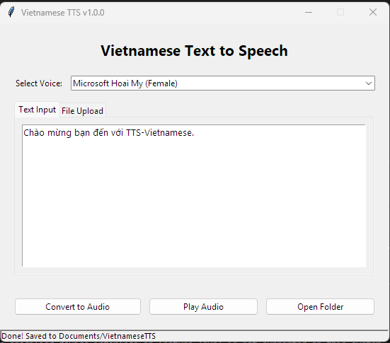

# Lito: Simple & Lightweight Text-to-Speech

A minimalist, high-quality desktop application to convert text into natural-sounding speech across multiple languages (Vietnamese, English, Chinese) using Microsoft Edge's online TTS services.



## Features

- **Global Support:** Natural-sounding voices for Vietnamese, English, and Chinese.
- **Minimalist UI:** Focus on what matters—simplicity and speed.
- **Format Support:** Converts plain text, Markdown (.md), and PDF files.
- **Native Playback:** Opens generated audio files in your default system media player.
- **High Quality:** Powered by `edge-tts` for crystal-clear audio.

## Downloads & Updates

- **Latest Version:** Download the latest executable from the [GitHub Releases](https://github.com/anhdhnguyen/tts-vietnamese/releases) page.
- **Changelog:** See [CHANGELOG.md](CHANGELOG.md) for a history of updates and changes.

## Setup & Installation

This project uses `uv` for package management.

1.  **Clone the repository:**
    ```bash
    git clone https://github.com/anhdhnguyen/tts-vietnamese.git
    cd tts-vietnamese
    ```

2.  **Install dependencies:**
    ```bash
    uv pip sync desktop-app/pyproject.toml
    ```

## How to Use

Run the desktop application:

```bash
python desktop-app/main.py
```

### Usage Steps:
1.  **Select a Voice:** Choose from curated high-quality voices for different languages.
2.  **Input Text:** Either type directly in the "Text Input" tab or upload a file in the "File Upload" tab.
3.  **Convert:** Click "Convert to Audio". The file will be saved to your `Documents/Lito` folder.
4.  **Play Audio:** Click "Play Audio" to open the result in your default media player.

## Directory Structure

```
.
├── desktop-app/        # Native Desktop Application (Tkinter)
├── assets/             # Images and branding assets
├── simple-tts/         # Legacy CLI scripts
└── README.md
```

## Contributing

Contributions are welcome! If you have ideas for improvements, feel free to open an issue or submit a pull request.